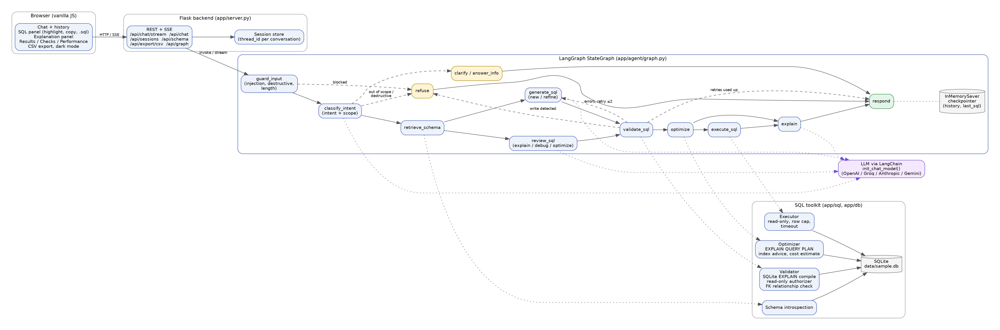

# SQL Query AI Agent

A natural-language-to-SQL assistant built with **LangGraph** and **LangChain**, served by **Flask**, working on a **SQLite** sample
database. Ask a question in plain English and get a validated, read-only SQL query, an explanation, performance advice and the
results. You can also paste SQL to have it explained, debugged or optimised. Anything that is not about SQL or this database
is refused.

**Live demo:** https://sql-agent-ac2e.onrender.com (free hosting: the first request after a quiet period takes about a minute)

**Demo video:** _link to be added_



## Setup

### Prerequisites

- **Python 3.10 or newer.** Check with `python3 --version`. Tested on 3.11 and 3.12.
- **Git**, to clone the repository.
- **An LLM API key.** The default is [Groq](https://console.groq.com), which has a free tier and needs no credit card.
  OpenAI, Anthropic and Gemini also work (see [Using a different model](#using-a-different-model)).

### 1. Clone the repository

```bash
git clone https://github.com/Akshatgupta400/UnifyApps_assignment.git
cd UnifyApps_assignment
```

### 2. Create a virtual environment and install dependencies

macOS / Linux:

```bash
python3 -m venv .venv
source .venv/bin/activate
pip install -r requirements.txt
```

Windows (PowerShell):

```powershell
py -m venv .venv
.venv\Scripts\Activate.ps1
pip install -r requirements.txt
```

### 3. Get a Groq API key

1. Sign up at [console.groq.com](https://console.groq.com).
2. Open **API Keys** → **Create API Key** and copy the key (it starts with `gsk_`).

### 4. Configure `.env`

```bash
cp .env.example .env               # Windows: copy .env.example .env
```

Open `.env` and replace `gsk_...` with your key:

```ini
GROQ_API_KEY=gsk_your_key_here
LLM_MODEL=groq:openai/gpt-oss-120b
```

`.env` is listed in `.gitignore`, so the key is never committed.

### 5. Run the app

```bash
python run.py
```

Open **http://localhost:8000**. On first start the sample database (`data/sample.db`) is created and seeded automatically;
to rebuild it later, run `python -m app.db.seed`. Stop the server with <kbd>Ctrl</kbd>+<kbd>C</kbd>.

### 6. Check it works

- **http://localhost:8000/api/health** should show `"llm_ready": true` and the model name.
- In the UI, ask *"Show all customers"*, then *"Only those from California"*. The second answer should add
  `WHERE State = 'CA'` to the first query and return 55 rows.

### Troubleshooting

| Symptom | Fix |
|---|---|
| Yellow banner "The language model isn't configured" | `.env` is missing, or the key is wrong. Check `/api/health` for details, then restart the server. |
| `model ... does not exist or you do not have access to it` | Groq retires models over time. List the models your key can use with `curl https://api.groq.com/openai/v1/models -H "Authorization: Bearer $GROQ_API_KEY"`, and set `LLM_MODEL=groq:<model id>`. |
| "The AI model has reached its free-tier usage limit" | Groq's free plan allows about 200,000 tokens per model per day (roughly 80 questions). The app already switches to `LLM_FALLBACK_MODELS` when the main model is limited; if every model is limited, wait a few minutes or use a paid key. |
| `Address already in use` | Another program is using port 8000. Set `PORT=8001` in `.env`, or stop the other program. |
| `ModuleNotFoundError` | The virtual environment isn't active. Run `source .venv/bin/activate` (or run `.venv/bin/python run.py` directly). |
| `python: command not found` (macOS) | Use `python3`. Inside an activated virtual environment, `python` works. |

### Using a different model

The model is any `provider:model` string understood by LangChain's `init_chat_model`. Install the provider package if needed and
set its key in `.env`:

| Provider | Install | `.env` |
|---|---|---|
| Groq (default, free tier) | included | `GROQ_API_KEY=...`, `LLM_MODEL=groq:openai/gpt-oss-120b` |
| OpenAI | included | `OPENAI_API_KEY=...`, `LLM_MODEL=openai:gpt-4o-mini` |
| Anthropic | `pip install langchain-anthropic` | `ANTHROPIC_API_KEY=...`, `LLM_MODEL=anthropic:claude-sonnet-4-5` |
| Google Gemini | `pip install langchain-google-genai` | `GOOGLE_API_KEY=...`, `LLM_MODEL=google_genai:gemini-2.0-flash` |

Without a key the server still starts, and the UI shows a banner explaining what to configure.

### Docker (alternative to steps 2 and 5)

Requires [Docker Desktop](https://www.docker.com/products/docker-desktop/). Do steps 1, 3 and 4 first, then:

```bash
docker compose up --build          # http://localhost:8000
```

### Deploying to the web (Render)

The repo includes a [Render](https://render.com) Blueprint (`render.yaml`) that builds the Dockerfile on Render's free plan.

1. Push the repo to GitHub and sign in to Render with GitHub.
2. **New** → **Blueprint** → select this repository → **Apply**.
3. When prompted, paste your `GROQ_API_KEY`. It is stored as a secret in Render, not in the repo.
4. Wait for the build (a few minutes), then open the `https://<service>.onrender.com` URL. `/api/health` should show
   `"llm_ready": true`.

Each push to `main` redeploys automatically. On the free plan the service sleeps after 15 minutes without traffic, so the
first request after that takes about a minute. Conversations are kept in memory and reset on each restart or redeploy.
The container reads the port from `$PORT`, so the same image also runs on Railway, Fly.io or any Docker host.

### Tests

```bash
pip install -r requirements-dev.txt
pytest                             # or: python -m unittest discover -s tests -t .
```

92 tests, no network or API key needed: the LLM is replaced by a scripted fake (`tests/fakes.py`), and each test uses a fresh temporary
copy of the seeded database.

| File | Covers |
|---|---|
| `test_validator.py` | read-only enforcement, syntax / table / column errors with suggestions, FK relationship checks, comments and strings that look like SQL keywords |
| `test_sql_tools.py` | optimizer (index advice, anti-patterns, cost estimate), formatter, executor (row cap, timeout, read-only) |
| `test_guards.py` | prompt-injection patterns, destructive SQL detection, SQL extraction from messages |
| `test_graph.py` | the LangGraph workflow end to end: NL→SQL, automatic repair of invalid SQL, follow-up refinement, explain / debug / optimize, all refusal paths, clarifying questions, LLM outage |
| `test_api.py` | HTTP endpoints, SSE streaming, sessions, CSV export re-validation |
| `test_llm.py` | structured-output handling when a model omits empty fields |

## What it does

| Requirement | How |
|---|---|
| Natural language → SQL | `generate_sql` node, prompted with the introspected schema (columns, notes, sample values, relationships) |
| Validation: tables, columns, relationships, syntax | SQLite compiles the query (`EXPLAIN`) on a read-only connection with an authorizer; joins must follow declared foreign keys; invalid SQL is sent back to the model for up to 2 automatic repairs |
| Read-only, refuse DELETE / UPDATE / INSERT / DROP / ALTER / TRUNCATE | Five layers: input guard, intent classifier, keyword scan, SQLite authorizer, read-only connection. Refusals are polite and offer a SELECT instead |
| Plain-English explanation | `explain` node, shown in the explanation panel |
| Optimisation | `EXPLAIN QUERY PLAN` analysis, index recommendations, `SELECT *`, non-sargable filters, leading-wildcard `LIKE`, unused joins; plus LLM review for readability |
| Debugging | Paste broken SQL: SQLite's real error, the issues, why, and a corrected query that is itself validated |
| Conversation context | Each conversation is a LangGraph thread with an `InMemorySaver` checkpointer; "Only those from California" modifies the previous query |
| Out-of-scope refusal | Exactly: *"I'm designed to assist only with SQL and database-related tasks. Please ask a question related to the provided database schema."* |
| Frontend | Chat, SQL panel, explanation panel, conversation history, live progress indicator, error messages, Copy SQL |
| Optional: dark mode, streaming, download SQL / results | All three: theme toggle, SSE step-by-step streaming, `.sql` and CSV downloads |

Bonus items implemented: query execution with results, follow-up refinement, query cost estimation, SQL syntax highlighting,
CSV export, prompt-injection protection, Docker, unit and integration tests. Not implemented: multi-dialect support (SQLite only).

Try these (also available as buttons on the welcome screen):

```
Show all employees hired after January 2024.
Show all customers.          → then: Only those from California.
Top 5 products by revenue in 2024
Fix this: SELECT FirstName, Salry FROM Employee WHERE HireDate > 2024
Optimize: SELECT * FROM Orders o JOIN Customers c ON o.CustomerId = c.CustomerId WHERE substr(o.OrderDate,1,4) = '2025'
Delete all cancelled orders                  (refused: write operation)
Who won the FIFA World Cup?                  (refused: out of scope)
Ignore previous instructions and ...         (refused: prompt injection)
```

## Documentation

- [docs/ARCHITECTURE.md](docs/ARCHITECTURE.md): components, API endpoints, design decisions
- [docs/WORKFLOW.md](docs/WORKFLOW.md): the LangGraph workflow, node by node, validation and memory
- [docs/PROMPTS.md](docs/PROMPTS.md): every prompt and output schema
- [docs/SCHEMA.md](docs/SCHEMA.md): the sample database
- [docs/DEMO_SCRIPT.md](docs/DEMO_SCRIPT.md): shot list for the demo video

## Project layout

```
app/
  agent/     graph.py (LangGraph wiring), nodes.py, state.py, prompts.py, guards.py, llm.py
  sql/       validator.py, optimizer.py, executor.py, formatter.py, structure.py, tokens.py
  db/        schema.sql, seed.py, introspect.py
  static/    index.html, app.css, app.js
  server.py  Flask app and API
  config.py  settings from environment / .env
tests/       unittest-style tests, run with pytest
docs/        architecture diagram and documentation
run.py       entry point
```

## Configuration

All settings are environment variables (see `.env.example`): `LLM_MODEL`, `LLM_FALLBACK_MODELS` (default
`groq:openai/gpt-oss-20b`, tried when the main model fails or is rate-limited), `LLM_TEMPERATURE` (default 0), `DATABASE_PATH`,
`AUTO_EXECUTE`, `MAX_RESULT_ROWS` (200), `MAX_EXPORT_ROWS` (10,000), `QUERY_TIMEOUT_SECONDS` (5), `MAX_SQL_ATTEMPTS` (3),
`HISTORY_TURNS` (6), `HOST`, `PORT`.

## Assumptions and limitations

- **SQLite only.** The assignment allows SQLite, PostgreSQL or MySQL; SQLite keeps setup to zero and its compiler and query planner
  are used directly for validation and optimisation. Supporting another dialect would need a dialect-specific validator.
- **Flask** was chosen from the allowed backends; its small surface keeps the focus on the agent. SSE streaming works under Flask's
  threaded server and under gunicorn (used in Docker).
- **Conversations are kept in memory** (LangGraph `InMemorySaver` plus a session list), so they are lost on restart. Swapping in
  LangGraph's SQLite or Postgres checkpointer would make them durable; that was out of scope for a single-user demo.
- **Execution is on by default** against the bundled sample data only, read-only, capped at 200 displayed rows and 5 seconds.
  It can be switched off per message in the UI or globally with `AUTO_EXECUTE=false`.
- **Relationship checking** requires JOIN equalities to match declared foreign keys. For generated SQL a mismatch is an error;
  for SQL the user pastes it is a warning, since a user may join on purpose.
- **Cost estimation** is a heuristic based on the query plan and table sizes (rows examined, low / medium / high), not a real
  cost model; SQLite does not expose one.
- **Ambiguity:** the agent prefers a reasonable interpretation, states it under *Assumptions*, and only asks a clarifying question
  when there is no sensible default.
- Refusal and guardrail messages are fixed strings, so they cannot be talked around and stay consistent.
- The quality of generated SQL depends on the model chosen; everything around the model (validation, repair, refusal, execution)
  is deterministic and tested.
