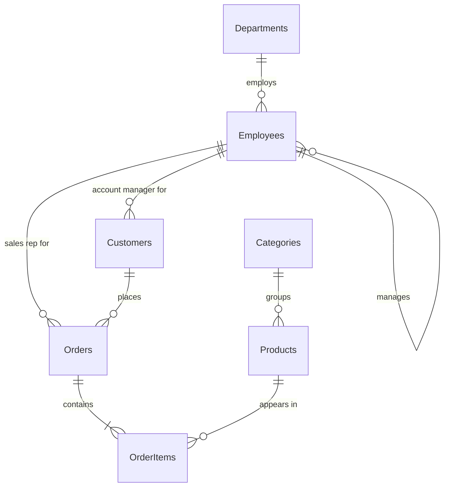

# Sample database schema

The full DDL is in [`app/db/schema.sql`](../app/db/schema.sql). The database (`data/sample.db`) is created and filled with
deterministic sample data by [`app/db/seed.py`](../app/db/seed.py) the first time the app starts, or on demand with
`python -m app.db.seed`.

It models a small retail company:

| Table | Rows | Columns |
|---|---|---|
| Departments | 6 | DepartmentId (PK), Name, Location, Budget |
| Employees | 60 | EmployeeId (PK), FirstName, LastName, Email, JobTitle, DepartmentId (FK), ManagerId (FK → Employees), HireDate, Salary, IsActive |
| Customers | 200 | CustomerId (PK), FirstName, LastName, Email, Phone, City, State (two-letter code), Country, Segment, CreatedAt, AccountManagerId (FK → Employees) |
| Categories | 6 | CategoryId (PK), Name, Description |
| Products | 28 | ProductId (PK), Name, CategoryId (FK), UnitPrice, UnitsInStock, Discontinued |
| Orders | 1,500 | OrderId (PK), CustomerId (FK), EmployeeId (FK, sales rep), OrderDate, Status, ShipCity, ShipState, TotalAmount |
| OrderItems | 3,797 | OrderItemId (PK), OrderId (FK), ProductId (FK), Quantity, UnitPrice, Discount |

Notes:

- Dates are ISO-8601 text (`'YYYY-MM-DD'`), so `HireDate >= '2024-01-01'` compares correctly.
- `Customers.State` holds codes such as `'CA'`; the schema prompt includes sample values so "California" becomes `State = 'CA'`.
- `Status` is one of `Pending`, `Shipped`, `Delivered`, `Cancelled`; `Segment` is `Consumer`, `Small Business` or `Enterprise`.
- Apart from primary keys there is only one index (`OrderItems(OrderId)`). This is deliberate, so the optimizer has real index
  recommendations to make, for example on `Orders(OrderDate)` or `Orders(CustomerId)`.
- The data is generated with a fixed random seed, so the numbers are stable (e.g. 10 employees hired on or after 2024-01-01,
  55 customers in California). Tests rely on this.

To use your own database, point `DATABASE_PATH` at another SQLite file. The schema is introspected at start-up, so prompts,
validation and the schema browser adapt automatically.
