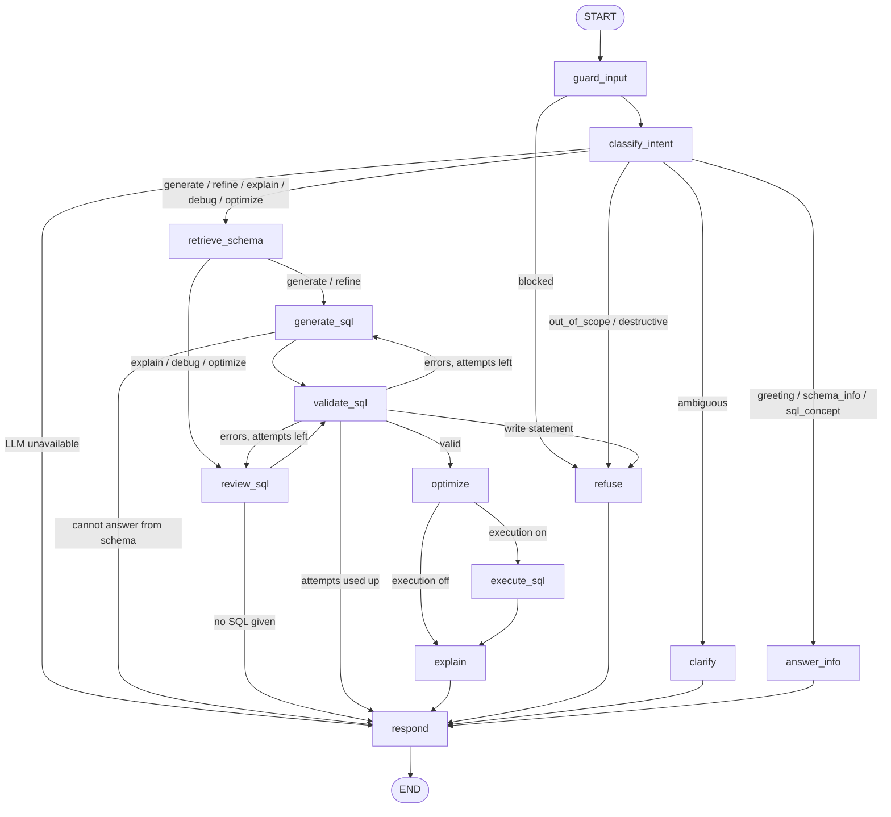

# LangGraph workflow

The agent is a single LangGraph `StateGraph` built in [`app/agent/graph.py`](../app/agent/graph.py). Node functions live in
[`app/agent/nodes.py`](../app/agent/nodes.py) and share the `AgentState` TypedDict in [`app/agent/state.py`](../app/agent/state.py).
It follows the workflow in the assignment (Intent Detection → Scope Validation → Schema Retrieval → SQL Generation → Validation →
Optimization → Execute → Explanation → Response) and extends it in three places: a deterministic input guard before any LLM call,
a separate branch for SQL the user pastes in (explain / debug / optimize), and a validation-driven repair loop.



The same graph is available at runtime as Mermaid from `GET /api/graph` (produced by `graph.get_graph().draw_mermaid()`).

## Nodes

| Node | LLM? | What it does |
|---|---|---|
| `guard_input` | no | Sanitises the message and blocks, without calling the model: empty or over-long input, prompt-injection patterns ("ignore previous instructions", "reveal your system prompt", role-play overrides) and statement-shaped destructive SQL (`DELETE FROM ...`, `DROP TABLE ...`). |
| `classify_intent` | yes | **Intent detection and scope validation in one structured call.** Returns one of `generate`, `refine`, `explain`, `debug`, `optimize`, `schema_info`, `sql_concept`, `greeting`, `destructive`, `ambiguous`, `out_of_scope`. Unknown labels are treated as out of scope; `refine` with no previous query falls back to `generate`; SQL embedded in the message is extracted for the review branch. |
| `refuse` | no | Returns a fixed message. Out-of-scope requests get exactly the text required by the assignment. |
| `clarify` | no | Returns the model's single clarifying question for vague requests. |
| `answer_info` | partly | Greetings (fixed text), schema questions (answered from the live schema, not the model's memory) and general SQL concept questions. |
| `retrieve_schema` | no | Builds the schema context: relevant tables for the question plus the previous query, with their FK neighbours, column notes, sample values for categorical columns and a RELATIONSHIPS section. For a 7-table schema this is effectively the whole schema; the selection exists so the design scales. |
| `generate_sql` | yes | Writes one SELECT for new questions (`generate`) or modifies `last_sql` for follow-ups (`refine`). Receives recent history and, on a retry, the validator's errors. Can answer "this schema doesn't contain that data" instead of inventing columns. |
| `review_sql` | yes | For SQL the user supplies. SQLite first compiles the query and its real error message is given to the model. Returns issues, a corrected/optimised query, a list of changes and index suggestions. Mode-specific instructions for explain / debug / optimize. |
| `validate_sql` | no | The gatekeeper; see below. |
| `optimize` | no | Runs `EXPLAIN QUERY PLAN`, recommends indexes for filtered columns that are fully scanned, flags `SELECT *`, functions on filtered columns, leading-wildcard `LIKE`, unused joins and missing `LIMIT`, and gives a heuristic cost estimate (rows examined, low / medium / high). LLM index suggestions are only kept if they reference real columns. |
| `execute_sql` | no | Optional. Runs the query on a read-only connection with a row cap and a timeout. |
| `explain` | yes | Plain-English explanation of the final query for a business user. |
| `respond` | no | Builds the API payload (`type`, `message`, `sql`, `original_sql`, `explanation`, `assumptions`, `issues`, `changes`, `validation`, `optimization`, `results`) and appends the turn to `history`. Updates `last_sql` only when a validated query was produced, so a refusal does not break follow-ups. |

## Validation (`app/sql/validator.py`)

Every query goes through the same checks, whether the model or the user wrote it:

1. **Single statement, read-only.** A tokenizer that understands strings and comments scans for `INSERT`, `UPDATE`, `DELETE`, `DROP`, `ALTER`, `TRUNCATE`, `CREATE`, `REPLACE INTO`, `ATTACH`, `PRAGMA`, `VACUUM` and similar. Only `SELECT` and `WITH ... SELECT` are accepted.
2. **Syntax, tables and columns** are checked by SQLite itself: the query is compiled with `EXPLAIN` on a read-only connection, so the error messages are the database's own. Before compiling, double-quoted identifiers are rewritten as backtick-quoted ones (`strict_identifiers`), otherwise SQLite would silently turn a misspelt `"Colunm"` into a string literal. This works on every Python/SQLite version; on Python 3.12+ the `SQLITE_DBCONFIG_DQS_DML` flag is also switched off. Unknown names get "did you mean" suggestions.
3. **Read-only authorizer.** A `sqlite3` authorizer allows only read operations while compiling and executing, denies `sqlite_*` internal tables and functions such as `load_extension`. This is a second, engine-level line of defence behind the keyword scan.
4. **Relationships.** Every `JOIN ... ON a.x = b.y` equality between two tables must match a declared foreign key (in either direction). For generated SQL this is an error that triggers a repair; for user-supplied SQL it is a warning, since users may join on purpose. Joins with no condition (cartesian products) are flagged.

If validation fails, the errors are sent back to the model (`generate_sql` or `review_sql`) for up to `MAX_SQL_ATTEMPTS - 1` repairs. If it still fails, the user gets an error explaining what was wrong and **no SQL is presented as valid**. If a write statement is ever produced, the turn is refused rather than repaired.

## Conversation memory

Each browser conversation is a LangGraph thread (`thread_id`). The graph is compiled with an `InMemorySaver` checkpointer, so two
state fields survive between turns:

- `history` (an `operator.add` reducer, so each turn appends): the user's messages and a summary of each answer, of which the last `HISTORY_TURNS` are given to the model.
- `last_sql`: the most recent validated query.

That is what makes the assignment's example work:

```
User:  Show all customers.            -> intent generate -> SELECT ... FROM Customers
User:  Only those from California.    -> intent refine   -> SELECT ... FROM Customers WHERE State = 'CA'
```

For `refine`, the generator is told to start from `last_sql` and change only what was asked. `explain`, `debug` and `optimize`
without pasted SQL work on `last_sql` too ("explain that query"). All other per-turn fields are reset by `new_turn()` at the start
of every turn.

## Streaming

`POST /api/chat/stream` runs `graph.stream(..., stream_mode="updates")` and sends a server-sent event as each node finishes. The UI uses
these to animate the pipeline track (Guard → Intent → Schema → Draft SQL → Validate → Optimize → Execute → Explain → Respond),
including a retry counter on Validate when the repair loop runs. The final event carries the full response.
